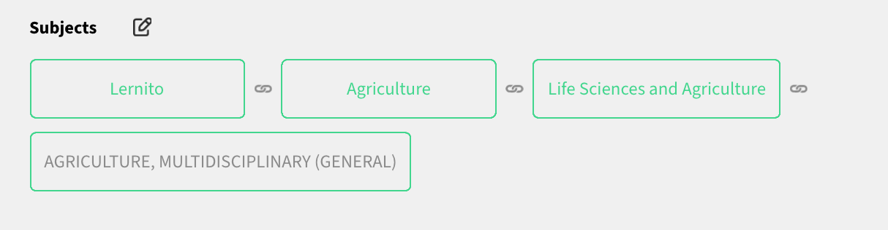

# Spec
We want to render a tree tag field and its editor form.  
We have 3 situations (check the screenshot):
  1. **View**: tree tag field value  
     
  2. **Edit**: add/remove tree tag fields from the previously selected tree  
  3. **Create**: a new tree tag field (when we want to create an item)  
     In create mode our editor will have 2 parts: `TreeSelector` which selects a subject tree and `TagEditor` which selects a branch from that subject tree.  
       
       

# Code

```tsx
interface TreeTagItem {
  _id: string;
  title: string;
  ancestors: TreeTagItem[];
}

export const TreeTag = ({
  fieldInfo,
  value, // the value of the field
  readonly,
}) => {
  const [treeId, setTreeId] = useState<string>();
  const tags: TreeTagItem[] = getTags(value, fieldInfo);

  useEffect(() => {
    if (fieldInfo.treeId) {
      setTreeId(fieldInfo.treeId);
    }
  }, [fieldInfo.treeId]);

  const [selectedNodeIds, setSelectedNodeIds] = useState(
    getExpandedNodeIds(
      tags.map((tag) => {
        return {
          _id: tag._id,
          title: tag.title,
          ancestors: tag.ancestors ?? [],
          children: [],
        };
      }),
    ),
  );

  const onSelectTag = (selectedTag: SelectedTreeNodeProps) => {
    const treeNodes: RenderingTreeNode[] = [
      {
        ...omit(selectedTag, 'treeInfo'),
        children: [],
      },
    ];

    let changedValue: SelectedTreeNodeProps | SelectedTreeNodeProps[] = [];
    let selectedNodeIdsValue: string[] = [];

    if (field.isArray) {
      const index = tags.findIndex((item) => item._id === selectedTag._id);

      if (index === -1) {
        selectedNodeIdsValue = [...selectedNodeIds, ...getExpandedNodeIds(treeNodes)];
        changedValue = (value ?? []).concat(selectedTag);
      } else {
        selectedNodeIdsValue = removeElementFromArray(selectedNodeIds, index);
        changedValue = removeElementFromArray(value, index);
      }
    } else {
      selectedNodeIdsValue = getExpandedNodeIds(treeNodes);
      changedValue = selectedTag;
    }
    setSelectedNodeIds(selectedNodeIdsValue);
    onChange(changedValue);
  };


  const getTagPath = (tag, index): Tag[] => {
    const treeInfo: TreeTagItem['treeInfo'] = getTreeInfo(value, index);
    const treeNameAsNode = {
      _id: treeInfo?._id,
      title: getTreeLocalField('name', treeInfo),
    };
    const convertedAncestor = tag.ancestors
      ? tag.ancestors.map((anc) => ({
          ...anc,
          title: getTreeLocalField('title', anc),
        }))
      : [];

    const tagPath = {
      _id: tag._id,
      title: getTreeLocalField('title', tag),
    };

    return treeInfo?._id
      ? [treeNameAsNode].concat(convertedAncestor, tagPath)
      : convertedAncestor.concat(tagPath);
  };

  return (
    <>
      {/* First render the tree tags */}
      <Grid container direction="row" spacing={2}>
        {tags.map((tag, idx) => (
          <DraggableWrapper key={idx} dataValue={tag._id}>
            <TagPath tagPath={getTagPath(tag, idx)} />
          </DraggableWrapper>
        ))}
      </Grid>
      {/* Then render the editor */}
      <Grid
        container
        direction="column"
        spacing={3}
        style={{ marginTop: tags.length === 0 ? '-4px' : '10px' }}
      >
        {!readonly && !field.treeId && (
          <Grid item style={{ width: '200px', marginBottom: '-4px' }}>
            <TreeSelector onSelect={setTreeId} treeId={treeId} />
          </Grid>
        )}
        {!readonly && treeId && (
          <Grid item>
            <EditTreeTag
              onSelectedNode={onSelectTag}
              treeId={treeId}
              selectedNodesId={selectedNodeIds}
            />
          </Grid>
        )}
      </Grid>
    </>
  );
};
```

`5 anti-patterns`
